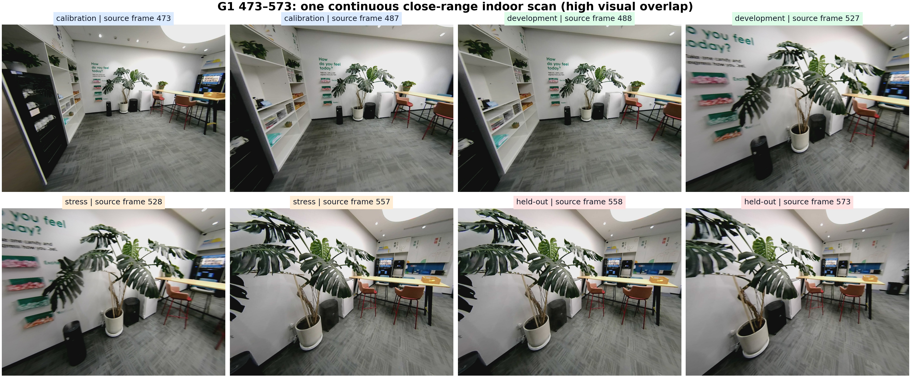
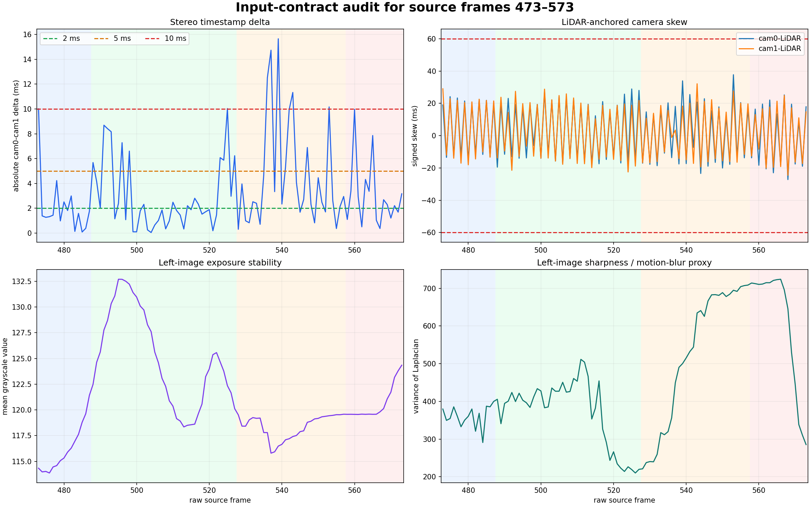
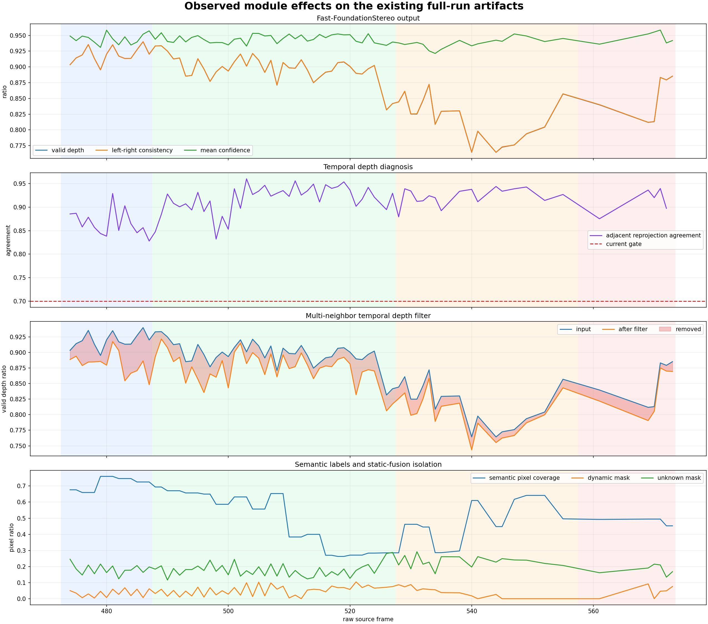
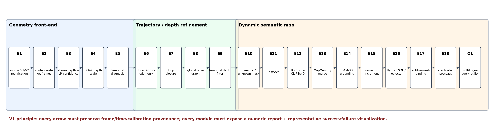

# G1 语义地图逐模块实验方案 V1

> 最新的独立执行方案：
> [G1 语义地图逐模块诊断实验方案 V1.1](g1_semantic_map_experiments_v1_1.md)。
>
> 数据集：`/home/user/datasets/g1_20260724`  
> 原始帧范围：473–573（含端点，共 101 帧）  
> 方案状态：**可以作为模块级微基准；不能单独作为跨场景最终验收**  
> 配套审计数据：
> [JSON](assets/g1_semantic_map_experiments_v1/g1_473_573_visual_audit.json) /
> [逐帧 CSV](assets/g1_semantic_map_experiments_v1/g1_473_573_per_frame.csv) /
> [产物校验清单](assets/g1_semantic_map_experiments_v1/artifact_manifest.json)

## 0. 结论先行

参照原文档
[g1_semantic_map_experiments.md](g1_semantic_map_experiments.md)
组织实验的思路是合适的，但**不能直接运行其配置或复用其结论**：

- 原文档绑定 `/home/user/datasets/test_ros2_all_tf_map` 的 815–915 帧；
- 本次数据使用 `g1_20260724` 的 473–573 帧、V1/V2 组合立体校正、公制深度尺度和
  `map_T_camera`；
- 原 workspace、共享输入、LiDAR 投影、人工标注和查询集都属于另一段数据；
- 原配置执行 `all` 会生成 77 个 variant、231 个三重复运行，成本高，而且包含本窗口无法
  评价的闭环与全局拓扑实验；
- 本窗口是同一房间内约 10 秒、2.14 m 路径、49.54° 转向的连续扫描。四个相邻分块仍高度
  相似，所以 `held-out` 只能称为**时间留出**，不能声称跨场景泛化。

因此 V1 采用：

1. 保留原 E0–E18、Q1 的逐模块思想、不可变运行目录、失败证据保留和三重复终验；
2. 重建本数据的输入、切分、真值、配置和 query set；
3. 先做单模块筛选，再只对候选做三重复端到端验证；
4. 以硬门和 Pareto 前沿选型，不用一个加权总分掩盖几何或语义失败；
5. 把 473–573 定位成微基准，最终 winner 仍需在不相邻的第二场景窗口复验。



## 1. 本次证据范围

### 1.1 已审计的真实输入

| 项目 | 结果 | 解释 |
| --- | ---: | --- |
| 原始帧 | 101 | 473–573，连续 10 秒左右 |
| 轨迹长度 / 首尾位移 | 2.142 / 1.958 m | 单次平滑移动，不构成闭环 |
| 总航向变化 | -49.54° | 能观察转向中的标定、深度和跟踪稳定性 |
| 左右目时间差 P50 / P95 / 最大 | 2.295 / 10.035 / 15.657 ms | 10 ms 附近存在明显边界样本 |
| `<=2 / 5 / 10 ms` | 46 / 80 / 94 帧 | 2 ms 覆盖不足；10 ms 是当前覆盖/错时折中基线 |
| 10 ms 未进入正式立体输入 | 473、525、536、537、539、543、553 | 原始输入和人工真值仍保留 |
| 关键帧链实际进入 | 76 帧 | 17 帧 pose motion，59 帧 image event |



### 1.2 V1/V2 组合校正是否能用于该窗口

V1/V2 组合是在不相邻的 653–953 帧拟合和验收，因此 473–573 可作为额外的独立局部检查。
本次使用 mutual-SIFT 的垂直残差作为**诊断代理**：

| 输入 | 帧中位残差的 P50 | P95 | 结论 |
| --- | ---: | ---: | --- |
| 当前单目去畸变 PNG | 2.938 px | 3.268 px | 不能直接按水平双目使用 |
| V1/V2 物化结果 | 0.315 px | 0.406 px | 该窗口中局部极线对齐明显改善 |

这不是正式标定真值。正式 E1 仍必须报告正视差比例、逐帧 P95、严格通过率和共同有效面积。


### 1.3 现有全量运行在该窗口内呈现出的模块效果

下表来自现有 844 帧全量运行中映射到原始 473–573 的 76 个选中帧，只能用作基线诊断；
它们不是隔离执行某一模块后的因果实验。

| 模块输出 | 均值 | P05 | P95 | 初步判断 |
| --- | ---: | ---: | ---: | --- |
| 双目深度有效率 | 0.880 | 0.789 | 0.933 | 覆盖较好 |
| 左右一致性 | 0.880 | 0.789 | 0.933 | stress 后段明显下降，需做误差图库 |
| 深度置信度 | 0.943 | 0.932 | 0.954 | 高置信不等于公制准确 |
| 相邻时序一致 | 0.909 | 0.845 | 0.948 | 高于当前 0.70 宽松门 |
| 过滤前有效率 | 0.880 | 0.789 | 0.933 | — |
| 过滤后有效率 | 0.857 | 0.782 | 0.904 | 平均移除 2.58% 原有效深度 |
| 每帧非零语义实例数 | 9.63 | 5 | 18 | 只有输出量，没有 GT 准确率 |
| 语义像素覆盖 | 0.529 | 0.271 | 0.746 | 随视角变化明显 |
| dynamic mask 比例 | 0.044 | 0 | 0.094 | 静态植物出现明显疑似误报 |
| unknown mask 比例 | 0.191 | 0.130 | 0.263 | 隔离安全，但损失不少静态深度 |
| MapMemory | 914 次观测 / 50 个实体 / 27 次语义操作 | — | — | 需用人工轨迹判断过合并/过拆分 |



代表帧为原始 569、选中帧 364，包含 19 个非零语义 ID：


图中可直接看到三个需要 V1 解决的问题：

- 近距离叶片、遮挡边界和弱纹理处是左右一致性与深度空洞的主要风险区；
- 红色/黄色隔离区域大量覆盖看似静态的植物和物体边缘，当前 dynamic 指标可能高估运动；
- exact-label 覆盖很高，但仅凭彩色标签无法知道 mask、track、自然语言名称和 mesh 绑定是否正确。

### 1.4 当前证据成熟度


最后一项人工 GT 为 0，不是说语义输出无效，而是说明当前不能计算真正的 Mask AP、HOTA、
实体合并精度、mesh 绑定精度和 query recall。**人工真值完成前，语义 variant 只允许诊断，
不得宣布 winner。**

## 2. 原实验方案的适用性审查

### 2.1 可以直接继承

| 原设计 | 是否继承 | 原因 |
| --- | --- | --- |
| E0–E18、Q1 的模块化编号 | 是 | 覆盖从输入到查询的完整链 |
| 每个 run 独立目录且不可覆盖 | 是 | 避免新旧参数和证据混合 |
| 运行配置、模型、代码、输入 SHA-256 | 是 | 支持复现和责任归因 |
| 失败硬门和失败图保留 | 是 | 防止只展示成功样本 |
| 像素不是独立统计样本 | 是 | 以帧块、轨迹、run 为统计单位 |
| baseline/winner 三重复 | 是 | 评估语义模型、GPU 调度和运行时波动 |
| query 最终独立评价 | 是 | 地图价值最终要落到检索和证据 |

### 2.2 必须替换

| 原文档内容 | 本次问题 | V1 处理 |
| --- | --- | --- |
| 数据集和 815–915 帧 | 完全不同的数据 | 固定为 `g1_20260724:473–573` |
| 旧 prepared/shared inputs | 标定、时间、图像都不匹配 | 新建 `experiments/g1_20260724_473_573_v1/` |
| LiDAR 右目校正路径 | 当前正式链是 V1/V2 左右共同校正 | 固定组合报告，不再把 LiDAR 单应当立体校正 |
| 旧 floor report | 当前使用深度尺度 + identity rotation | 在 calibration split 重新估计尺度 |
| 旧人工标注和 query set | 对象、画面、轨迹不相同 | 重新标注和冻结中英查询集 |
| 全 231 个 run | 许多确定性重复和无闭环 variant 浪费 | 分阶段筛选，终验才三重复 |

### 2.3 原方案在本窗口上的方法学缺口

1. **相邻块泄漏。** 四个 split 都属于同一连续视角，最后 16 帧与前面画面高度重叠。
2. **无闭环。** 2.14 m 单向轨迹不能评价 E7/E8 的闭环召回和全局拓扑。
3. **现有尺度泄漏。** 固定 `depth_scale=0.842653...` 的原全量训练/留出样本包含
   475/476、489/490、503/504、517/518、532/533、569/570 等本窗口帧。若直接复用，不能再
   把 558–573 称为对尺度独立的 held-out。
4. **现有中间产物不是 slice run。** 它们由 844 帧运行生成；全局地图和实体生命周期受到
   窗口外帧影响。
5. **续跑污染运行时统计。** 现有语义运行从选中帧 600 续跑，最终报告中的分割/跟踪延迟只
   统计后 244 帧，不能代表本窗口。
6. **动态指标接近构造性通过。** `dynamic_contamination_rate=0` 只证明标成 dynamic 的
   深度已清零，不测 false positive 或 false negative。
7. **缺少语义 GT 指标。** 当前 collector 主要收集完成率、深度和投递数，尚未形成 Mask
   AP、HOTA、实体 F1、绑定 F1、查询拒绝率的统一比较。
8. **三重复策略没有区分确定性。** 同一冻结输入上的同步、物化和确定性过滤无需重复三次；
   随机模型、GPU 调度、DAM 和端到端运行才需要。

## 3. V1 科学问题和总流程



V1 必须回答五个逐级问题：

1. 输入是否在时间、像素、相机顺序、pose 和标定意义上正确？
2. 深度是否既有覆盖又有 LiDAR 公制精度、边缘质量和跨帧稳定性？
3. 动静隔离是否减少 ghost，同时不过度删除静态植物、椅子和桌边？
4. FastSAM、BotSort、DAM、MapMemory 和 Hydra 是否保持同一真实物体的身份与几何？
5. 最终 DSG 是否能稳定回答中英文查询，并给出正确位置、mesh 和证据？

依赖关系固定为：

```text
P0 输入/真值硬门
  -> P1 几何 winner
      -> P2 动态隔离 winner
          -> P3 分割/跟踪/语义 winner
              -> P4 Hydra/DSG winner
                  -> P5 Query 与端到端终验
```

上游硬门未通过时，下游只能标记为 diagnostic，不能用于模块效果归因。

## 4. 数据切分与防泄漏

### 4.1 为兼容当前 manager 的物理 split

| split | 帧 | 数量 | 用途 |
| --- | --- | ---: | --- |
| calibration | 473–487 | 15 | 深度尺度、阈值量纲检查；不选最终 variant |
| development | 488–527 | 40 | variant 筛选和错误分析 |
| stress | 528–557 | 30 | 叶片遮挡、深度下降、同步缺帧、稀疏选帧 |
| held-out | 558–573 | 16 | 只做一次时间留出终验 |

### 4.2 统计核心与边界缓冲

所有 101 帧仍参与连续处理，保证跟踪和时序滤波不被人为截断；但主统计排除 split 开头
5 帧，降低相邻画面直接泄漏：

| 统计核心 | 帧 | 说明 |
| --- | --- | --- |
| development core | 493–522 | 488–492 只作 warm-up/buffer |
| stress core | 533–552 | 528–532 只作 warm-up/buffer |
| held-out core | 563–573 | 558–562 只作 warm-up/buffer |

即使如此，held-out 仍只代表同场景时间稳定性。跨场景结论必须追加第二窗口，并在本 V1
冻结后才能打开。

### 4.3 标定防泄漏

- V1/V2 组合校正固定使用 653–953 已冻结报告；不得在 473–573 上重新拟合。
- 公制深度尺度必须新增 `scale_473_487.json`，只用 calibration 帧估计。
- `0.842653...` 作为“外部全量尺度 baseline”保留，但因看过本窗口帧，只能作描述性对照。
- development/stress/held-out LiDAR 只做评价，不得反向修改尺度、阈值或有效 ROI。

## 5. 人工真值计划

### 5.1 标注层级

| 层级 | 覆盖 | 必须字段 |
| --- | --- | --- |
| L0 输入 | 101 帧 | 左右同步状态、模糊/曝光、遮挡、标定可匹配性 |
| L1 动静 | 101 帧低分辨率 mask | static/dynamic/unknown；植物叶片单独作为 hard negative |
| L2 实例 | 25 个 anchor 帧精细 mask | object ID、名称、属性、可见率、遮挡、should-have-mesh |
| L3 轨迹 | 101 帧 | 跨帧 track ID、进入/离开、遮挡、ID switch |
| L4 几何 | 同步通过的 anchor 帧 | LiDAR 稀疏深度、3D 中心/尺寸可信区间 |
| L5 DSG | 每条 GT 轨迹 | canonical entity、允许别名、正确 mesh/spatial-only 状态 |
| L6 查询 | 冻结 GT 后生成 | 中英正查询、近义词、属性查询、负查询和期望拒绝 |

推荐 25 个精细 anchor 覆盖四个 split、深度低谷、语义变化和边界帧；held-out anchor
100% 双人复核，其余至少 20% 双人复核。所有算法失败样本自动进入额外复核队列。

### 5.2 不能用自动提案替代的真值

- FastSAM mask 不能回填为自己的 GT；
- LiDAR 连通域可做 3D 提案，但不能自动决定语义名称或同一实体；
- DAM 描述可辅助列候选名称，但人工必须确认 canonical name 和可接受别名；
- Hydra object node 不能作为 `should_have_mesh` 的真值，因为这正是 E16/E17 的被测对象。

## 6. V1 实验矩阵

### 6.1 几何前端 E0–E9

| ID | 模块 | V1 variant | 主指标 | 每个 variant 必须输出 |
| --- | --- | --- | --- | --- |
| E0 | 端到端 baseline | 当前冻结参数 | 全部硬门、总时延、query | 全流程 summary + 失败 gallery |
| E1 | 输入契约 | sync 2/5/10 ms；camera order；raw negative control；V1/V2 formal | 覆盖、dy、正视差、有效面积、pose/time | 同帧极线图、残差曲线、缺帧表 |
| E2 | 关键帧 | all/default/dense/sparse | GT 事件召回、最大时间/位姿空洞、耗时 | 决策时间线、保留/丢弃 montage |
| E3 | 双目深度 | iters 4/8/16；disp 320/416；validity/LR | LiDAR AbsRel/MAE/P90、边缘误差、覆盖、时延 | disparity/depth/confidence/error 四联图 |
| E4 | 公制尺度 | nominal 1.0；external 0.84265 diagnostic；calibration-only scale | 分 split LiDAR 有符号误差和 AbsRel | 误差直方图、距离分箱、scale 稳定图 |
| E5 | 时序诊断 | normal；noise/pose-offset/scale 三个注入 | 对已知注入的检出能力、agreement | worst-pair gallery、误差与运动散点 |
| E6 | RGB-D odometry | source pose；default；conservative | RPE、fallback 比例、收敛、相对 source 变化 | XY/yaw 对比、约束残差图 |
| E7 | 闭环 | none；retrieval-only diagnostic | 只检查误触发；不选闭环 winner | 候选 contact sheet、拒绝原因 |
| E8 | 全局图 | source pose formal；local-only diagnostic | 不得因无 loop 宣称全局改善 | 源/局部轨迹与残差 |
| E9 | 时序过滤 | off/lenient/default/strict | LiDAR 误差改善、有效率损失、边缘保留、flicker | 前后深度、removed mask、错误曲线 |

现有全量 odometry 报告已显示 optimizer 达到最大评估次数且 `success=false`，loop report 为
0 个 verified loop，最终全局阶段实际保留 source trajectory。因此 E6–E8 在本窗口的任务是
验证“不恶化”和避免误闭环，不是证明全局 SLAM 能力。

### 6.2 动态与语义 E10–E18

| ID | 模块 | V1 variant | 主指标 | 当前特别关注 |
| --- | --- | --- | --- | --- |
| E10 | dynamic isolation | off/default/intermediate/sensitive | dynamic P/R/F1、静态 FPR、unknown、ghost | 植物叶片/桌边静态误报 |
| E11 | FastSAM | baseline；conf 0.2/0.4；area 150/300/600；IoU 0.4/0.6 | Mask AP50/AP75、小物体召回、延迟 | 不能用 mask 数量代替准确率 |
| E12 | BotSort/ReID | ReID on/off；ECC；buffer 10/30/60 | HOTA、IDF1、ID switch、fragmentation | 镜头转向和大叶片遮挡 |
| E13 | MapMemory merge | 0.20/0.35/0.50 m | entity precision/recall、over-merge、over-split | 相邻椅子、屏幕、柜体 |
| E14 | DAM | observations 3/5/8 | 命名准确率、描述覆盖、首描述延迟、prompt 数 | 低门可能早错，高门可能漏物体 |
| E15 | semantic increment | geometry/frontend/DAM | 每层增益与额外成本 | 必须同一固定几何输入 |
| E16 | Hydra | 12 cm resource baseline；5 cm；3 cm diagnostic；object obs 4/8；min volume | mesh 完整/精度、object recall、global P95、内存 | 全量 12 cm 运行 global P95 已为 305 ms |
| E17 | DSG binding | strict/medium/wide | binding precision/recall、conflict、rejected-no-mesh | 宽门不能用召回掩盖误绑定 |
| E18 | exact postpass | live provisional diagnostic / exact formal | 标签覆盖、逐帧 hash、最终 DSG commit | exact 是正式交付必要条件 |

E10 的现有 `dynamic_contamination_rate` 继续保留为“隔离实现正确性”指标，但 winner 必须按
人工 dynamic GT 的 precision/recall/F1 选择。

### 6.3 查询 Q1

至少包含：

- 正查询：植物、椅子、桌子、屏幕/显示器、柜体、垃圾桶等可见对象；
- 中英同义词：如“蓝色椅子 / blue chair”；
- 属性查询：颜色、相对位置、外观；
- hard negative：窗口中不存在但语义相近的对象；
- mesh-required 与允许 spatial-only 两种模式。

主指标：

- Recall@1、Recall@3、MRR；
- 负查询 false-accept rate 和拒绝理由；
- top-1 margin 与阈值曲线；
- 位置误差、mesh/spatial-only 状态正确率；
- 证据图片覆盖率和证据是否确实包含目标。

## 7. 指标与门限

### 7.1 先过硬门

| 层 | V1 硬门 |
| --- | --- |
| 输入 | 101 条 manifest/pose/图像/LiDAR 完整；只有满足 variant 同步门的帧进入该 variant |
| 立体校正 | 留出 `dy` P50 `<=1 px`、帧内 P95 的 P50 `<=3 px`、正视差 `>=95%`、严格帧 `>=90%`、共同有效面积 `>=75%` |
| 深度 | calibration-only scale；LiDAR median AbsRel `<=12%`；LR consistency 均值 `>=0.80`；时间一致均值 `>=0.85` |
| 过滤 | 有效率平均损失 `<=5` 个百分点，且 LiDAR 或 flicker 至少一项有统计改善 |
| 动态 | mask 应用后泄漏 `<=1%`；人工 GT 静态区域 FPR 建议 `<=2%`；unknown `<=30%` |
| 语义 | GT 完成并 reviewed；无 pending/unmapped/error；exact-label 覆盖 100% |
| DSG | binding precision `>=95%`；所有 rejected-no-mesh 有审计原因 |
| Query | 证据绑定校验通过；正/负 query 均有冻结预期 |
| 运行时 | 沿用 `realtime_quality_gates.yaml`；尤其 global service P95 `<=250 ms` |

Mask AP、HOTA、entity recall 和 query recall 的最终硬阈值应在 GT pilot 完成后冻结；在没有
pilot 方差前写很高的拍脑袋阈值，会诱导针对 25 个 anchor 过拟合。

### 7.2 Pareto 选型，不直接求一个总分

候选先按以下四维形成 Pareto 前沿：

1. 几何：LiDAR 误差、时序一致、mesh 完整度；
2. 语义：Mask AP、HOTA、entity F1、binding F1；
3. 查询：Recall@K、负查询拒绝、证据覆盖；
4. 成本：P95 latency、GPU/RSS、运行时间、产物体积。

只有需要在 Pareto 候选中做业务取舍时才使用建议权重：

```text
geometry 30% + semantics/tracking 30% + DSG/query 25% + efficiency 15%
```

任一硬门失败，权重得分无效。

## 8. 可视化交付契约

每个 run 除数值报告外，必须生成：

```text
visualizations/
├── 00_input_timeline.png
├── 01_stereo_epipolar_success_failure.png
├── 02_disparity_depth_confidence_montage.png
├── 03_lidar_depth_error_by_range.png
├── 04_temporal_best_worst_pairs.png
├── 05_keyframe_decision_timeline.png
├── 06_trajectory_constraints.png
├── 07_dynamic_gt_overlay.png
├── 08_fastsam_gt_overlay.png
├── 09_tracking_id_timeline.png
├── 10_entity_merge_graph.png
├── 11_hydra_mesh_topdown.png
├── 12_dsg_binding_lines.png
├── 13_query_topk_evidence.png
└── 14_variant_delta_against_baseline.png
```

每张比较图必须：

- 固定相同帧、颜色范围、裁剪 ROI 和相机坐标；
- 同时展示成功、P50、P95 和最差样本；
- 标注原始帧、选中帧、时间戳、variant、关键参数；
- 不得只挑“看起来最好”的一张；
- 对 dropped/missing 帧显示占位卡和原因，而不是从 montage 中消失。

## 9. 执行策略

### 9.1 P0：只做准备，不跑大模型

1. 创建新 workspace：`experiments/g1_20260724_473_573_v1`；
2. 冻结输入、代码、环境、V1/V2 报告和模型 hash；
3. 生成 101 帧 split manifest 和 annotation tasks；
4. 完成同步/相机顺序/极线/pose/time 预检；
5. 只用 473–487 拟合深度 scale；
6. 冻结 GT pilot 和 query set。

P0 失败时停止。

### 9.2 P1–P4：逐层筛选

- 确定性几何模块每个 cell 先跑 1 次；
- 参数注入实验只验证诊断灵敏度，不参与 winner；
- 每层只把 hard-pass 的 Pareto 候选传给下一层；
- E7/E8 在本窗口保持 diagnostic，不扩展无意义的组合；
- 语义模块先单次筛选，top-2 再用 seed 0/1/2 重复；
- 上游产物通过 hash 引用，禁止复制后手工修改。

### 9.3 P5：端到端终验

baseline 和最终 winner 均：

- 从空目录、帧 0 开始，不允许 `--resume`；
- seed 0/1/2 三次；
- 保留完整 telemetry、frame artifacts、可视化和 hash；
- development/stress 报告完成后才解封 held-out；
- held-out 打开后不再调参；
- 若 held-out 硬失败，失败结论保留，进入 V2，不回写 V1。

该分阶段策略比对 77 个 variant 全部三重复更经济，也更容易归因。预计先筛选约 70 个
单模块 cell，再只对各层 top-2 和最终 baseline/winner 补足三重复；不应一开始就发起
231 次完整语义建图。

## 10. 当前代码在执行 V1 前需要补齐

现有 manager 可复用，但还需要以下工程改动后才能称为“一键 V1”：

1. 新配置指向 `g1_20260724:473–573` 和独立 workspace；
2. 支持 per-profile experiment catalog，避免默认生成全部旧 variant；
3. collector 增加 slice-aware 指标，不再只读全运行 aggregate；
4. 增加 split core/buffer 的统计过滤；
5. 增加 dynamic GT、Mask AP、HOTA/IDF1、entity/binding F1 和 query 指标；
6. scale calibration 强制只读 calibration split；
7. 运行规格记录“formal / diagnostic / not-applicable”；
8. E7/E8 对无闭环窗口明确输出 not-applicable，而不是把 0 verified loop 当算法失败；
9. 自动生成本方案第 8 节的固定版式图；
10. preflight 检查所有共享产物是否绑定同一数据集、帧段和标定 hash。

在这些改动完成前，不应把旧配置简单复制、替换三行路径后直接执行 `all`。

## 11. 可复现审计命令

当前报告和图片由以下命令生成：

```bash
cd /home/user/Code/DAAAM_Origin
source .repro/ros2_ws/install/setup.bash

.repro/venv/bin/python \
  scripts/analyze_g1_473_573_experiment_window.py
```

配套脚本：
[analyze_g1_473_573_experiment_window.py](../scripts/analyze_g1_473_573_experiment_window.py)

该脚本只读取原始数据和已有产物，输出逐帧 CSV、JSON、图像及 SHA-256 清单；不会修改
数据集或重新运行模型。

## 12. 审核决策表

| 审核问题 | 当前回答 |
| --- | --- |
| 能否直接使用旧实验配置？ | 否 |
| 能否复用 E0–E18/Q1 框架？ | 是 |
| 473–573 是否适合模块级实验？ | 是，尤其适合同场景转向、遮挡和近距离对象 |
| 是否适合闭环/房间拓扑验收？ | 否 |
| 当前 V1/V2 校正是否值得进入实验？ | 是；局部诊断残差明显改善，但正式 E1 仍需完整硬门 |
| 当前深度是否可作为 baseline？ | 是；覆盖和时序指标较好，公制尺度需防泄漏重做 |
| 当前 dynamic 结论是否可信？ | 不足；缺 GT，且代表图出现明显疑似静态误报 |
| 当前 semantic 数量能否证明准确？ | 不能 |
| 当前全量地图是否严格质量通过？ | 否；既有 global service P95 305.46 ms 超 250 ms |
| 何时可以宣布 V1 winner？ | GT 完成、从零三重复、held-out 只打开一次且全部硬门通过后 |
