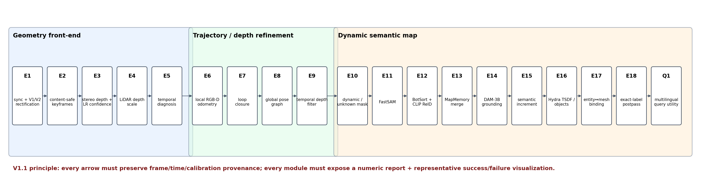
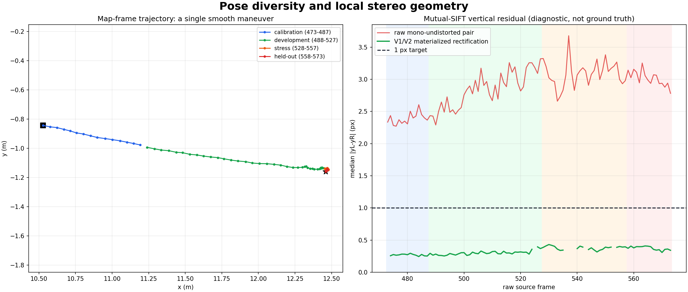
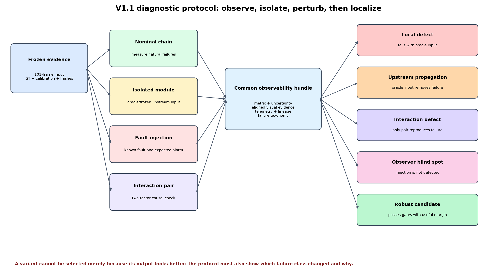
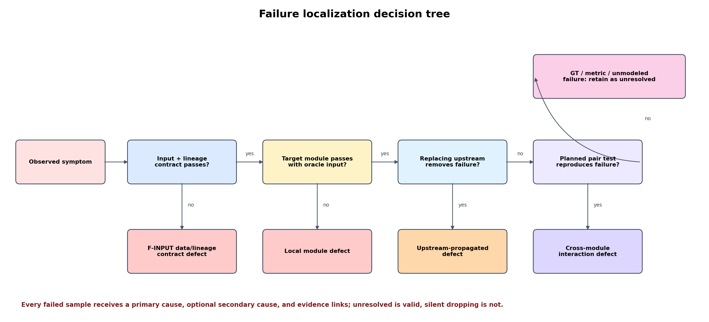
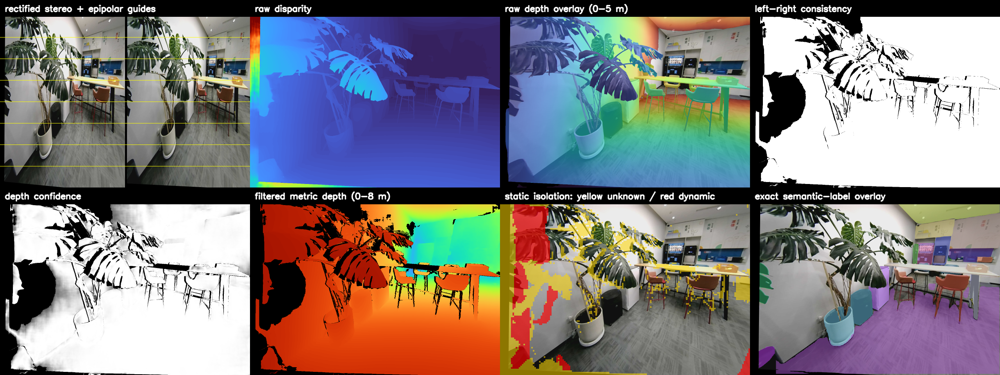
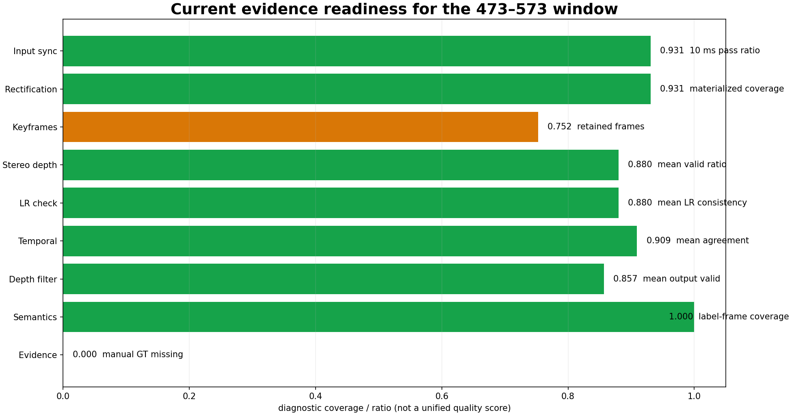

# G1 语义地图逐模块诊断实验方案 V1.1

> 当前阶段覆盖（2026-07-28）：按用户要求，暂时跳过人工 L0–L6 GT、双人标注/裁决和
> 独立 held-out 封存，进入
> [`diagnostic_gt_free`](g1_semantic_map_diagnostic_no_gt_stage.md) 阶段。原 V1.1 的正式
> GT、排名和 held-out 验收条件保持不变；本阶段只做全链路工程完整性、内部一致性、
> 故障注入、失败定位和可视化评估，不能产出正式 winner 或语义准确率结论。

> 数据集：`/home/user/datasets/g1_20260724`  
> 原始帧：473–573（含端点，共 101 帧）  
> 左目：cam0；右目：cam1  
> 目标：定位语义地图流水线的局部缺陷、上游传播、跨模块交互和性能瓶颈，并选择可解释、
> 可复现、对扰动稳健的配置  
> 配套审计：
> [JSON](assets/g1_semantic_map_experiments_v1_1/g1_473_573_visual_audit.json) /
> [逐帧 CSV](assets/g1_semantic_map_experiments_v1_1/g1_473_573_per_frame.csv) /
> [产物清单](assets/g1_semantic_map_experiments_v1_1/artifact_manifest.json)

## 0. 实验结论边界

473–573 帧是一段约 10 秒的室内近距离连续扫描，轨迹长 2.142 m，首尾位移 1.958 m，
航向变化 -49.54°。画面包含植物叶片、桌椅、柜体、显示设备、遮挡边界、弱纹理墙面和
明显的近景转向，适合研究：

- 双目时间同步、立体校正和深度质量；
- 关键帧选择、局部位姿与时序深度过滤；
- 静态/动态/unknown 隔离；
- 实例分割、跟踪、实体合并和语义描述；
- TSDF/mesh、DSG 绑定和语义查询；
- 模块错误如何向下游传播，以及质量与运行时之间的取舍。

该窗口高度连续、场景单一且不形成闭环，因此只能形成**同场景模块级微基准**。它不能单独
证明闭环召回、全局拓扑正确性、跨房间泛化或长期实体一致性。E7/E8 在本实验中只检查误闭环
和“不恶化”；系统发布前必须增加独立场景窗口。

本方案的成功标准不是“某个输出看起来更好”，而是同时满足：

1. 已知故障能够被正确指标发现；
2. 自然失败能够定位到局部模块、上游传播或跨模块交互；
3. 候选通过完整性硬门和任务质量门；
4. 改善在时间块、对象和随机重复上稳定；
5. 最终地图能正确回答冻结查询，并返回可审核的图像和几何证据。

## 1. 流水线与研究问题



正式链路固定为：

```text
原始同步与位姿
  -> V1/V2 立体校正
  -> 关键帧
  -> 双目深度 / LR 置信度
  -> 公制尺度
  -> 局部位姿与时序过滤
  -> dynamic / unknown 隔离
  -> FastSAM
  -> BotSort + ReID
  -> MapMemory
  -> DAM 语义
  -> Hydra TSDF / object
  -> entity↔mesh 绑定
  -> exact-label postpass
  -> DSG 语义查询
```

实验必须逐级回答：

1. 输入的帧、时间戳、相机顺序、位姿、坐标系和标定是否自洽？
2. 深度错误来自同步、校正、匹配、尺度、位姿还是过滤？
3. 动态隔离是在减少 ghost，还是误删植物、桌边等静态结构？
4. 语义问题来自漏分割、错分割、ID switch、错误合并，还是 DAM 命名？
5. 3D 中的对象缺失来自没有深度、没有融合、没有 object node，还是绑定门限？
6. 查询失败来自名称、实体、位置、mesh、证据或拒绝阈值中的哪一层？
7. 精度改善是否以不可接受的延迟、显存、内存或产物体积为代价？

上游硬门未通过时，下游结果只能标记为 `diagnostic`，不得用于证明下游算法优劣。

## 2. 数据审计与实验切分

### 2.1 输入概况


| 项目 | 结果 | 实验含义 |
| --- | ---: | --- |
| 原始帧数 | 101 | 所有帧都进入输入完整性审计 |
| 左右时间差 P50 / P95 / 最大 | 2.295 / 10.035 / 15.657 ms | 必须分同步难度报告 |
| `<=2 ms` | 46 帧 | 高同步质量层 |
| `(2,5] ms` | 34 帧 | 中等同步层 |
| `(5,10] ms` | 14 帧 | 边界同步层 |
| `>10 ms` | 7 帧 | 正式 10 ms 双目链不使用，但保留失败证据 |
| 已物化校正 | 94 帧 | 与 10 ms 同步覆盖一致 |
| 进入现有关键帧链 | 76 帧 | 关键帧保留率 75.25% |


所有指标必须同时按原始帧、同步层、数据 split 和场景挑战标签报告。只给 101 帧平均值会
掩盖边界同步、近景叶片和转向阶段的退化。

### 2.2 物理切分

所有 101 帧连续处理，以免人为切断跟踪和时序滤波；模型选择只使用指定统计核心。

| split | 完整处理帧 | 统计核心 | 用途 |
| --- | --- | --- | --- |
| calibration | 473–487 | 473–487 | 公制尺度、指标量纲和标注 pilot；不选最终参数 |
| development | 488–527 | 493–522 | 单模块筛选和错误归因 |
| stress | 528–557 | 533–552 | 近景遮挡、低深度质量、同步边界和稀疏帧压力 |
| held-out | 558–573 | 563–573 | 参数冻结后只打开一次的时间留出终验 |

development、stress 和 held-out 开头 5 帧只作 warm-up/buffer。held-out 与前段仍有高视觉
重叠，因此它只评价同场景时间稳定性，不代表跨场景泛化。

### 2.3 场景挑战标签

每帧允许多个标签。标签在查看候选实验结果前由输入统计和人工审阅冻结：

| 标签 | 生成规则 | 主要检查 |
| --- | --- | --- |
| `sync_2/5/10/over10` | 按左右时间差分层 | 错时运动对极线和深度的影响 |
| `blur_low` | 清晰度处于输入 P05 | 分割、匹配和 ReID 退化 |
| `exposure_edge` | 亮度处于 P05/P95 | 特征与 mask 稳定性 |
| `turning` | 相邻帧 yaw/光流超过冻结阈值 | 位姿、跟踪和动态误判 |
| `plant_boundary` | 人工标出叶片及其 15 px 边界带 | 静态误报、深度飞点、mask 边界 |
| `thin_structure` | 椅腿、桌腿、叶柄等 | disparity、TSDF 和 mesh 完整度 |
| `occluded` | GT 可见率低于 50% | ID switch、实体重建 |
| `semantic_dense` | GT 同帧可见实例数处于最高四分位 | 分割、合并和运行时 |

每个 variant 必须输出 `metrics_by_challenge_tag.json`。某候选整体平均改善但任一关键标签明显
退化时，不得直接晋级。

## 3. 输入、标定与产物契约

### 3.1 不可变输入

- cam0 固定为左目，cam1 固定为右目；
- `2d_rect` 图像已经完成单目去畸变，不允许再次套用原畸变模型；
- 正式立体输入使用冻结的 V1/V2 组合校正映射；
- V1/V2 映射只作为固定输入，不在 473–573 上重新拟合；
- 位姿统一为 `map_T_camera`，所有矩阵必须记录 from/to frame；
- 深度单位统一为米，PNG 存储单位必须在 manifest 中明确；
- 原始帧号、prepared 帧号、selected 帧号和 sensor time 必须可双向查询。

局部诊断显示，单目去畸变图像的 mutual-SIFT 垂直残差中位数约 2.938 px，物化立体校正后
约 0.315 px。该结果只作为特征代理；正式 E1 仍使用人工对应点、正视差比例和共同有效面积。



### 3.2 公制尺度防泄漏

- 仅用 calibration 473–487 估计 `scale_473_487.json`；
- development、stress、held-out 的 LiDAR 只用于评价；
- 有效 ROI、深度截断和置信阈值不得根据 held-out 修改；
- scale 报告必须包含样本帧、点数、距离分箱、估计方法、置信区间和输入 hash。

### 3.3 每个运行必须冻结

```text
run_manifest.json
├── dataset path + source-frame range
├── source/prepared/selected tick-index hashes
├── calibration/map/scale hashes
├── code commit + dirty patch hash
├── Python/CUDA/driver/model hashes
├── experiment ID + run type + variant + seed
├── complete parameter tree
├── upstream artifact IDs and hashes
├── GT/query-set versions
└── start/end time + exit status + failure reason
```

任何产物 hash 或坐标契约不匹配时，运行状态为 `invalid-input`，不能与其他 variant 比较。

## 4. 真值与审核协议

### 4.1 真值层级

| 层 | 覆盖 | 必须标注 |
| --- | --- | --- |
| L0 输入 | 101 帧 | 同步可用性、模糊、曝光、遮挡、可匹配性、缺失原因 |
| L1 动静 | 101 帧低分辨率 mask | static/dynamic/unknown；植物单列 hard negative |
| L2 实例 | 25 个冻结 anchor 精细 mask | instance ID、类别/名称、属性、可见率、遮挡 |
| L3 轨迹 | 101 帧 | GT track ID、进入/离开、遮挡区间、可匹配状态 |
| L4 几何 | 25 个 anchor | LiDAR 深度、有效投影、遮挡标记、3D 中心/尺寸置信区间 |
| L5 DSG | 每条 GT 实体轨迹 | canonical entity、别名、should-have-mesh、空间关系 |
| L6 查询 | 冻结 48 条 | 正查询、同义词、属性/空间、hard negative、mesh/evidence 要求 |

25 个精细 anchor 按 calibration/development/stress/held-out 分配为 4/10/7/4。选择规则先按
split、挑战标签和时间均匀覆盖，再固定随机种子抽样；不得根据某个算法的成功图挑选。
算法失败样本可以进入额外诊断集，但不能替换冻结评分集。

### 4.2 标注质量

- held-out anchor 100% 双人独立标注；
- 其余 anchor 至少 20% 双人独立标注；
- mask 报告标注者 IoU，track/实体报告一致率和争议项；
- 争议由第三人裁决，原始版本和裁决版本都保留；
- held-out GT 和 held-out query 由独立审核者封存；调参人员在 P8 前只能看到版本号和
  SHA-256，不能读取标注内容或评分；
- 自动分割、DAM 描述、MapMemory 或 Hydra node 只能作为提案，不能成为自己的真值；
- LiDAR 投影在遮挡边界和时间不同步处必须标记 `not-judgeable`，不能当错误深度。

### 4.3 查询集

48 条查询建议均分为：

- 16 条中英文对象正查询；
- 8 条同义词/别名查询；
- 8 条颜色、相对位置或外观查询；
- 8 条 hard negative；
- 8 条明确要求 mesh、位置或证据图的查询。

每条查询冻结期望实体、允许别名、允许的 top-k、位置容差、mesh/spatial-only 状态和拒绝
理由。查询集只能在 L5 GT 冻结后生成。

## 5. 诊断实验结构



每个被测模块至少具有以下四种运行之一：

| 类型 | 目的 | 输入 | 可以得出的结论 |
| --- | --- | --- | --- |
| N：nominal | 发现自然数据中的真实失败 | 正式上游链 | 端到端现象和实际频率 |
| I：isolated | 判断模块本身是否失败 | 冻结或 oracle 上游产物 | 局部模块能力 |
| F：fault injection | 证明指标能发现已知问题 | 人工注入单一故障 | 观测灵敏度和报警盲区 |
| X：interaction | 检查两个模块的非加性影响 | 2×2 配对组合 | 跨模块耦合 |

隔离实验的 oracle 层级固定如下，避免临时挑选“有利输入”：

| 被测层 | oracle / 冻结输入 | 可以隔离的结论 |
| --- | --- | --- |
| E3 深度 | 通过 E1 硬门的固定校正对 + 固定同步帧集 | 深度网络本身的匹配、覆盖和置信质量 |
| E6/E9 位姿过滤 | 冻结深度 + source pose；另用注入 pose 检查灵敏度 | pose 与过滤的局部作用 |
| E11 分割 | 原始 RGB + GT dynamic/unknown 区域 | 分割能力，不受错误运动 mask 影响 |
| E12 跟踪 | GT instance mask/detection | 跟踪能力，不受分割漏检影响 |
| E13 合并 | GT track fragments 与 GT 3D 中心 | 合并能力，不受 ID switch 影响 |
| E14 DAM | GT entity crops/observations | 命名能力，不受错误实体合并影响 |
| E16 Hydra | 冻结最佳深度与 source pose | TSDF/object 参数作用 |
| E17 绑定 | GT entity + 冻结 Hydra object/mesh | 绑定门限作用 |
| Q1 查询 | GT DSG 与系统 DSG 各跑一次 | 检索器问题与地图内容问题 |

每个实验单元必须在运行前填写：

```yaml
hypothesis:
controlled_input:
single_changed_factor:
expected_improvement:
expected_failure_signature:
primary_metric:
guardrail_metrics:
challenge_tags:
hard_gate:
upstream_oracle:
visualizations:
failure_taxonomy_codes:
```

缺少预注册假设或一次改变多个未声明因素的运行只能标记为 `exploratory`。

## 6. D0：观测系统资格验证

在参数优选前先验证指标、告警和可视化是否真的能发现问题。故障只注入
development/stress 副本，不修改正式输入和 held-out。

| 注入 | 剂量 | 应首先报警的模块 | 必须出现的可观察响应 |
| --- | --- | --- | --- |
| 左右时间偏移 | ±2/5/10/20 ms | E1/E3 | 同步分层变化；运动区极线/深度单调恶化 |
| camera-LiDAR 时间偏移 | ±20/40/60 ms | L4/E4 collector | GT 投影有效率下降且边界误差增加 |
| 左右相机交换 | 完全交换 | E1 | 正视差比例或相机顺序硬门失败 |
| 错误校正方向 | identity / inverse / 单侧错误 | E1/E3 | 垂直残差、正视差、有效面积显著失败 |
| 位姿平移 | 2/5/10 cm | E5/E6/E9 | 重投影误差随剂量增加 |
| 位姿 yaw | 0.5/1/3° | E5/E6/E9 | 边界重影、时序 agreement 单调下降 |
| 深度尺度 | ±5/10/20% | E4/E16 | LiDAR signed error 和 mesh 尺度同向变化 |
| 连续丢帧 | 1/3/5 帧 | E2/E12 | 最大时间空洞、ID fragmentation 增加 |
| 模糊/JPEG | σ=1/2；Q=80/60 | E3/E11/E12 | 特征、Mask AP、ReID 逐级下降 |
| dynamic mask 腐蚀/膨胀 | 3/9 px | E10/E16 | ghost 与静态结构损失呈相反变化 |
| track ID 置换 | 1/3/5 个实体 | E12/E13 | ID switch、over-split 和实体冲突上升 |
| entity 位置偏移 | 0.1/0.3/0.6 m | E17/Q1 | 绑定拒绝或错误 mesh 率上升 |
| 别名冲突/干扰项 | 1/3 个相近名称 | E14/Q1 | top-1 margin 下降或正确拒绝 |

D0 通过要求：

- 中/重度注入在 eligible 注入帧/运行上的检出率至少 90%；
- 无注入 control 的误报警率低于 5%；
- 有序剂量的主指标方向正确；
- 报警能够链接到对应帧、对象和证据图。

若 D0 失败，应先修指标和可观测性，不得用失明的指标选择算法。

## 7. 逐模块实验矩阵

### 7.1 E0–E5：输入与深度

| ID | 假设 | 正式候选 | 主指标 | 典型失败签名 |
| --- | --- | --- | --- | --- |
| E0 | 冻结 baseline 可完整运行并产生全部证据 | 1 个冻结基线 | 全硬门、任务指标、P95 latency | 缺产物、续跑污染、跨帧号错位 |
| E1 | 同步与 V1/V2 校正满足水平双目条件 | sync 2/5/10 ms；V1/V2 formal | 覆盖、dy、正视差、共同有效面积 | 转向时 dy 上升、负视差、边缘黑区 |
| E2 | 关键帧减少计算且不丢失语义/运动事件 | all/default/dense/sparse | GT 事件召回、最大时间/位姿空洞、成本 | 物体只出现于丢弃帧、长时间断轨 |
| E3 | 深度参数能在覆盖、LiDAR 精度和速度间形成稳定前沿 | iters 4/8/16 × disp 320/416；top-2 再比 LR/validity | AbsRel、MAE、P90、边缘误差、覆盖、延迟 | 叶片飞点、近物截断、高置信错误 |
| E4 | calibration-only scale 能消除系统尺度偏差 | scale=1；calibration-only | signed error、AbsRel、距离分箱、scale CI | 误差随距离单调、不同 split 偏差反向 |
| E5 | 时序诊断能区分 pose、scale 和深度噪声 | normal + D0 注入 | 注入检出率、agreement、误差-运动关系 | 指标不随注入变化或自然帧频繁误报 |

raw 单目去畸变对、相机交换和错误校正方向是 E1 的 negative control，不参与候选选择。
E3 先做 3×2 小型全因子，避免把 `iters` 与 `max_disp` 的交互误判为单因素效果。

### 7.2 E6–E10：位姿、过滤与动态隔离

| ID | 假设 | 正式候选 | 主指标 | 典型失败签名 |
| --- | --- | --- | --- | --- |
| E6 | RGB-D 约束能改善或至少不破坏 source pose | source/default/conservative | RPE、inlier、收敛、fallback、轨迹变化 | optimizer 不收敛却写回位姿、局部跳变 |
| E7 | 无真实闭环时系统能拒绝相似近邻 | none formal；retrieval-only diagnostic | false proposal/verification、拒绝理由 | 高重叠相邻帧被误当闭环 |
| E8 | 无闭环窗口不应产生虚假的全局改善 | source formal；local-only diagnostic | 约束残差、轨迹变化、状态正确性 | 0 loop 却宣称 global gain |
| E9 | 时序过滤减少闪烁和飞点且不过度删深度 | off/lenient/default/strict | LiDAR Δ、flicker、边缘保留、有效率损失 | 叶片/椅腿被整块删除、错误深度被保留 |
| E10 | 动态隔离减少 ghost 且保持静态结构 | off/default/intermediate/sensitive | dynamic F1、static FPR、unknown、ghost | 静态植物标红、真人/运动物漏检 |

E6 写回规则必须为：优化成功、残差改善、位姿增量在上限内三项同时满足；否则明确 fallback。
本窗口没有独立高精度轨迹真值，因此 E6 只能判断相对 source pose 的一致性和不恶化，不能
宣称绝对轨迹精度提升。

E10 的“dynamic 区域深度已清零”只验证实现，不代表动态识别正确。若 L1 审核确认本窗口
没有真实动态正样本，则 dynamic recall/F1 标记为 `not-applicable`，本窗口只正式评价静态
FPR、unknown 和 ghost；动态漏检必须在包含真实运动对象的独立窗口验收。合成运动只用于
D0 观测资格，不替代真实动态测试。

### 7.3 E11–E15：分割、跟踪、实体和语义

| ID | 假设 | 筛选方式 | 主指标 | 典型失败签名 |
| --- | --- | --- | --- | --- |
| E11 | FastSAM 在小物体、遮挡和延迟之间存在可用前沿 | conf 0.2/0.4；area 150/300/600；IoU 0.4/0.6 分阶段筛选 | Mask AP50/AP75、boundary F、small recall、P95 | 椅腿漏检、植物粘连、碎片 mask |
| E12 | BotSort/ReID 能在转向和遮挡后保持身份 | ReID on/off；ECC；buffer 10/30/60 | HOTA、IDF1、ID switch、fragmentation | 遮挡后换 ID、相邻椅子串 ID |
| E13 | MapMemory 合并距离能减少碎片且不合并不同物体 | 0.20/0.35/0.50 m | entity P/R/F1、over-merge、over-split | 两把椅子合一、同一植物多实体 |
| E14 | DAM 观察门限能平衡早期错命名与描述缺失 | observations 3/5/8 | 名称准确率、描述覆盖、首描述延迟、调用数 | 少帧自信错名、长期 pending |
| E15 | 每层语义能力带来可归因的任务增益 | geometry/frontend/DAM | Mask→track→entity→query 增量与成本 | 中间指标提升但查询无改善 |

E11、E12、E13 必须使用固定的上游 oracle/冻结输入各跑一组 isolated 实验。否则无法区分
“分割漏了”与“跟踪丢了”，也无法区分“跟踪碎片”与“实体合并太严”。

### 7.4 E16–E18、Q1：3D 地图、绑定与查询

| ID | 假设 | 正式候选 | 主指标 | 典型失败签名 |
| --- | --- | --- | --- | --- |
| E16 | 体素与 object 参数能形成几何质量/资源前沿 | 12 cm baseline；5 cm；3 cm diagnostic；obs 4/8；min volume | mesh completeness/accuracy、object recall、内存、P95 | 薄结构消失、噪声表面、global 超时 |
| E17 | 绑定门限能保持高 precision 并覆盖真实对象 | strict/medium/wide | binding P/R、冲突、错 mesh、rejected-no-mesh | 实体绑到相邻椅子、无 mesh 被静默丢弃 |
| E18 | exact postpass 能生成确定、完整、可提交标签 | live provisional diagnostic；exact formal | 100% 标签、hash 稳定、无 pending/error | 同帧重跑标签变化、未映射 ID |
| Q1 | DSG 能回答中英文正负查询并给出正确证据 | 冻结 query set + 阈值曲线 | Recall@1/3、MRR、FAR、位置/mesh/证据正确率 | 名称对但位置错、负查询误接受、证据不含目标 |

3 cm Hydra 只作为资源诊断，若实时硬门失败则不能作为正式 winner。Q1 必须分别报告
`not-found`、`low-confidence`、`no-mesh`、`ambiguous`，不能统一算成空结果。
E16 的 mesh completeness/accuracy 只对相机和 LiDAR 实际可见表面评分；稀疏 LiDAR 不能
作为物体背面或遮挡面的完整几何真值。

## 8. 跨模块交互实验

单模块最优组合不一定是端到端最优。以下交互使用 baseline 与各自 top candidate 构成 2×2
配对实验；主效应通过后才运行交互。

| ID | 模块对 | 要发现的问题 | 交互指标 |
| --- | --- | --- | --- |
| X1 | 同步门 × 立体校正 | 更严格同步是否只是在删除难帧 | 同帧集合上的 dy/深度变化 + 覆盖损失 |
| X2 | 校正 × 深度参数 | 深度网络是否在补偿错误几何 | LiDAR/边缘误差的非加性变化 |
| X3 | 关键帧 × 跟踪 buffer | 稀疏帧是否需要更长 track memory | HOTA、fragmentation、延迟 |
| X4 | pose × 时序过滤 | pose 误差是否被误当深度不一致 | filter reject 与 pose injection 响应 |
| X5 | 深度置信 × TSDF 体素 | 高覆盖低置信是否污染 mesh | mesh accuracy/completeness、资源 |
| X6 | dynamic mask × FastSAM | 隔离是否切坏实例 mask | dynamic F1、Mask AP、边界 F |
| X7 | FastSAM × BotSort | mask 粒度是否导致 ID switch | Mask AP 与 HOTA 联合变化 |
| X8 | tracking × entity merge | 轨迹碎片是否被错误空间合并掩盖 | over-merge/over-split、实体 F1 |
| X9 | DAM 门限 × entity merge | 错误早期名称是否传播到合并实体 | 名称冲突、语义操作、query |
| X10 | voxel/object × DSG binding | object node 几何是否决定绑定成功 | binding P/R、错 mesh、no-mesh |
| X11 | exact postpass × query | provisional 标签是否制造虚假查询增益 | query 指标、标签 hash、错误类型 |

定义配对交互量：

```text
interaction = Δ(A+B) - Δ(A only) - Δ(B only)
```

同时报告 block-bootstrap 置信区间。交互量大于预注册的最小实际差异，或引发新的硬门失败，
就必须作为独立问题记录，而不是简单归给其中一个模块。

## 9. 指标、硬门与晋级规则

### 9.1 不可妥协的完整性门

| 层 | 硬门 |
| --- | --- |
| 输入 | 101 个 source frame 唯一且可追溯；图像/pose/LiDAR/hash 完整 |
| 坐标 | 所有变换写明 from/to；旋转正交、行列式约 1；单位明确 |
| 运行 | 禁止覆盖；禁止未声明 resume；exit status 和失败原因完整 |
| 产物 | frame/time/calibration lineage 一致；缺帧必须有原因 |
| 真值 | GT 版本 reviewed；评分集在 variant 运行前冻结 |
| 比较 | 同一比较使用相同可判断样本；missing 作为结果报告 |

### 9.2 工程质量门

| 模块 | V1.1 门限 |
| --- | --- |
| 立体 | dy P50 `<=1 px`；帧内 P95 的 P50 `<=3 px`；正视差 `>=95%`；严格通过帧 `>=90%`；共同有效面积 `>=75%` |
| 关键帧 | GT 事件召回建议 `>=95%`；最大处理空洞 `<=0.5 s` |
| 深度 | calibration-only scale；LiDAR median AbsRel `<=12%`；LR consistency 均值 `>=0.80` |
| 时序 | agreement 均值 `>=0.85`；中/重度注入检出 `>=90%` |
| 过滤 | 有效率平均损失 `<=5` 个百分点；LiDAR 或 flicker 至少一项有实际改善 |
| dynamic | 实现泄漏 `<=1%`；静态区域 FPR 建议 `<=2%`；unknown `<=30%` |
| 语义 | 无 pending/unmapped/error；exact label-frame 覆盖 100% |
| DSG | binding precision 建议 `>=95%`；所有 no-mesh/reject 有明确原因 |
| Query | 正负查询均有冻结预期；证据绑定校验 100% 可追溯 |
| 运行时 | global service P95 `<=250 ms`，同时报告分模块 P50/P95/max |

Mask AP、HOTA、entity recall、query recall 等依赖人工 GT 的最终门限，在 GT pilot 完成后、
任何候选结果打开前冻结。表中的“建议”值是工程起点，不替代 pilot 方差和业务容忍度。

### 9.3 晋级

候选只有在以下条件同时满足时才能进入下一层：

1. 完整性门全部通过；
2. 本模块主指标优于 baseline，且 guardrail 无实质退化；
3. 关键挑战标签没有隐藏失败；
4. severe fault injection 能被正确发现；
5. 失败样本均有 taxonomy 和证据；
6. 资源消耗没有越过实时硬门。

## 10. 统计协议

- 帧不是独立同分布样本；逐帧指标使用长度 5 的时间块 bootstrap，至少 5000 次；
- 分割使用 anchor-frame bootstrap，跟踪使用 GT trajectory bootstrap，实体/查询使用
  entity/query bootstrap；
- variant 对比必须配对到相同 source frame、track、entity 或 query；
- 报告绝对值、paired delta、95% CI 和最小实际差异，不只报告百分比改善；
- 确定性输入/校正/物化运行 1 次；随机模型、GPU 调度、DAM 和端到端候选用 seed 0/1/2；
- 三次重复必须从空运行目录开始，不允许 resume；
- dropped、not-judgeable 和失败运行分别计数，不能做静默 complete-case 删除；
- held-out core 只有 11 帧，结果以描述性终验为主，不做夸大的显著性声明；
- 若三个 seed 的方向不一致，候选标记为 `unstable`，不能用最好一次代表结果。

## 11. 故障分类与定位



| 代码 | 类别 | 示例 |
| --- | --- | --- |
| F-INPUT | 输入/lineage | 帧号错位、时间戳错、相机交换、hash 不一致 |
| F-RECT | 校正 | 垂直残差、负视差、有效面积不足 |
| F-DEPTH | 深度 | 飞点、空洞、尺度偏差、过度自信 |
| F-POSE | pose/时序 | 重投影失败、优化跳变、过滤误拒绝 |
| F-KEY | 关键帧 | 事件漏选、时间空洞 |
| F-MOTION | 动静隔离 | 静态误报、动态漏检、unknown 过多 |
| F-SEG | 分割 | 漏实例、粘连、碎片、边界差 |
| F-TRACK | 跟踪 | ID switch、fragmentation、错误延续 |
| F-ENTITY | 实体/语义 | over-merge、over-split、错命名、pending |
| F-HYDRA | Hydra | mesh 缺失、噪声表面、object node 缺失 |
| F-BIND | DSG 绑定 | 错 mesh、无原因拒绝、空间关系错误 |
| F-QUERY | 查询 | 漏检、误接受、证据错误、拒绝理由错误 |
| F-COMP | 计算资源 | deadline miss、OOM、队列积压 |
| F-OBS | 观测盲区 | 已知注入未被指标或告警发现 |
| F-UNRESOLVED | 未解决 | GT 不确定或当前实验不能区分 |

每个失败样本记录一个 primary cause、零个或多个 secondary cause、首次出现模块、下游症状和
证据链接。`F-UNRESOLVED` 是允许的诚实结论；没有记录就丢弃失败样本是不允许的。

## 12. 执行阶段与停止规则

### P0：冻结与预检

1. 创建 `experiments/g1_20260724_473_573_v1_1/`；
2. 生成 source/split/challenge manifest；
3. 冻结标定、代码、环境、模型和输入 hash；
4. 验证帧号、时间、坐标、单位、相机顺序和 LiDAR 投影；
5. 建立完整性 dashboard。

任一 `F-INPUT` 未解决则停止。

### P1：真值与门限

1. 完成 L0–L6；held-out 部分由独立审核者加密/权限隔离封存；
2. 完成双人标注和裁决；
3. 运行 GT pilot；
4. 冻结最终质量门、最小实际差异和 query set。

GT 未 reviewed 时，语义/DSG 运行只允许调试，不允许排名。

### P2：D0 观测资格

运行无注入 control 和故障剂量序列。检出率、误报率或剂量方向失败时，先改 collector、
告警和可视化，不继续参数优选。

### P3：隔离式几何筛选

按 E1→E5→E6/E9→E10 运行。每层只传递 hard-pass 的 Pareto top-2；E7/E8 保持
`diagnostic/not-applicable`。

### P4：隔离式语义筛选

使用冻结几何输入运行 E11→E14，并以 E15 检查每层任务增益。top-2 才补 seed 0/1/2。

### P5：3D、DSG 与查询

运行 E16→E18→Q1。查询失败必须反查到 label、entity、mesh 和 evidence 四层。

### P6：交互实验

只对已观察到传播风险或主效应通过的 X1–X11 运行 2×2。禁止无目的全组合爆炸。

### P7：development/stress 端到端

baseline 与候选从空目录运行三次。失败仍完整保留。只有 hard-pass 且稳定的 Pareto 候选
可以锁定为 provisional winner。

### P8：held-out 一次终验

解封 held-out 后禁止修改参数、GT、阈值和 ROI。失败就记录为 V1.1 失败结论，不回写调参。

### P9：外部场景验证

使用不相邻且包含闭环/跨房间/更长遮挡的第二窗口。完成前，结论只能是
`best-on-g1-473-573-microbenchmark`。

## 13. 运行预算原则

- 确定性模块：每个 screening cell 1 次；
- 随机语义模块：先 1 次筛选，top-2 再补足 3 seeds；
- 交互：先用 development 单次 2×2，出现实质交互后在 stress 补 3 seeds；
- 端到端：baseline 与 provisional winner 各 3 次；
- 明确 N/A 的闭环与全局图不扩展参数网格；
- hard-fail 可以停止后续重计算，但必须完成当前失败证据和 manifest；
- 上游产物按 hash 引用，禁止复制后手工修改。

## 14. 可视化交付

### 14.1 当前诊断基线

现有全量运行映射到该窗口的 76 个选中帧显示：

| 观察量 | 均值 | P05 | P95 |
| --- | ---: | ---: | ---: |
| 深度有效率 | 0.880 | 0.789 | 0.933 |
| LR consistency | 0.880 | 0.789 | 0.933 |
| 相邻时序 agreement | 0.909 | 0.845 | 0.948 |
| 过滤后有效率 | 0.857 | 0.782 | 0.904 |
| dynamic ratio | 0.044 | 0.000 | 0.094 |
| unknown ratio | 0.191 | 0.130 | 0.263 |

这些数值来自长序列运行的窗口切片，只是诊断基线，不是隔离式消融结果。


代表帧展示了校正、disparity、深度、LR、置信度、过滤、动态隔离和语义标签的连续效果。
植物和物体边界上的红/黄区域是 E10 必须用 GT 查明的静态误报风险。



### 14.2 每个 run 的固定图表

```text
visualizations/
├── 00_input_and_lineage_timeline.png
├── 01_challenge_tag_coverage.png
├── 02_epipolar_success_p50_p95_worst.png
├── 03_disparity_depth_confidence_lidar.png
├── 04_depth_error_by_range_and_boundary.png
├── 05_temporal_pair_best_p50_worst.png
├── 06_keyframe_keep_drop_timeline.png
├── 07_pose_constraints_and_fallbacks.png
├── 08_dynamic_gt_overlay.png
├── 09_mask_gt_boundary_overlay.png
├── 10_track_id_timeline.png
├── 11_entity_merge_graph.png
├── 12_mesh_topdown_and_completeness.png
├── 13_entity_mesh_binding_lines.png
├── 14_query_topk_and_evidence.png
├── 15_failure_taxonomy_heatmap.png
├── 16_injection_dose_response.png
├── 17_paired_delta_with_ci.png
├── 18_interaction_2x2.png
└── 19_resource_timeline.png
```

比较图必须固定帧、ROI、颜色范围、坐标系和排序，同时显示 success、P50、P95 和 worst。
缺失帧必须显示占位卡与原因。图中的每个点必须能跳转到逐帧 JSON 和原始产物。



该图只表示当前证据覆盖，不是统一质量分数。人工 GT 完成前，Mask AP、HOTA、实体 F1、
binding F1 和 query recall 均不能正式计算。

## 15. 最优方案选择

先按硬门淘汰，再在以下维度建立 Pareto 前沿：

1. 几何：LiDAR 误差、边界误差、时序一致、mesh 完整/准确；
2. 语义：Mask AP、HOTA、entity F1、命名准确率、binding F1；
3. 任务：Recall@1/3、MRR、负查询 FAR、位置/mesh/证据正确率；
4. 稳健：挑战标签最差组、fault-injection 响应、seed 方差；
5. 成本：P95 latency、GPU/RSS、运行时间、产物体积。

选择顺序为：

```text
完整性与安全硬门
  > 查询/DSG 任务可用性
  > 几何与语义质量
  > 最差挑战组稳健性
  > 运行时和资源成本
```

不使用一个加权总分掩盖硬失败。若业务必须在 Pareto 候选间取舍，应同时展示候选雷达之外的
原始指标表、paired delta 和 worst-case gallery，并把权重写入决策记录。

正式 winner 需要：

- development、stress、held-out 全部硬门通过；
- 三个 seed 方向一致；
- severe injection 告警合格；
- 没有未解释的关键挑战组退化；
- query 和 evidence 通过；
- 从零复跑 hash 稳定；
- 明确标注结论只适用于当前微基准。

## 16. 实验目录与交付

```text
experiments/g1_20260724_473_573_v1_1/
├── protocol/
│   ├── frozen_plan.md
│   ├── thresholds.yaml
│   ├── failure_taxonomy.yaml
│   └── query_set.json
├── manifests/
│   ├── source_frames.json
│   ├── splits.json
│   ├── challenge_tags.json
│   └── artifact_hashes.json
├── ground_truth/
│   ├── annotations/
│   ├── adjudication/
│   └── quality_report.json
├── shared_artifacts/
├── runs/<experiment>/<variant>/<seed>/
│   ├── run_manifest.json
│   ├── metrics.json
│   ├── metrics_by_challenge_tag.json
│   ├── failures.jsonl
│   ├── telemetry.jsonl
│   └── visualizations/
├── comparisons/
│   ├── paired_effects.json
│   ├── interactions.json
│   └── pareto_candidates.json
└── final/
    ├── decision.json
    ├── report.md
    └── report.html
```

执行前需要支持：

- per-profile 实验 catalog；
- slice/core/buffer-aware collector；
- oracle 输入和 D0 故障注入；
- Mask AP、boundary F、HOTA/IDF1、entity/binding/query 指标；
- 挑战标签分层和 block bootstrap；
- `formal/diagnostic/not-applicable/invalid-input` 状态；
- 自动失败分类、证据链接和固定图表；
- scale 只能读取 calibration split 的强制检查；
- shared artifact 的数据集、帧段、标定和代码 hash preflight。

## 17. 审核检查表

| 审核问题 | 通过条件 |
| --- | --- |
| 输入正确吗？ | 101 帧可追溯，坐标/单位/相机顺序/时间通过 |
| 指标能发现问题吗？ | D0 检出率、误报率和剂量方向通过 |
| 模块效果可归因吗？ | 有 isolated/oracle 对照，单因素明确 |
| 上游错误被区分了吗？ | 失败定位树和 propagation 证据完整 |
| 交互被检查了吗？ | 风险模块对完成 2×2 和 interaction CI |
| 平均值掩盖最差情况了吗？ | 有 challenge-tag、P95、worst gallery |
| 语义准确吗？ | 有 reviewed GT，不以 mask/label 数量替代准确率 |
| 3D 实体可靠吗？ | entity、mesh、binding 分层评分 |
| 查询真的有用吗？ | 正负查询、位置、mesh 和 evidence 全部评价 |
| 结果稳定吗？ | block bootstrap + 三 seeds + held-out 一次终验 |
| 运行可复现吗？ | manifest、hash、空目录复跑和不可覆盖 |
| 可以宣布通用最优吗？ | 不可以；还需独立场景和闭环窗口 |

## 18. 可复现审计命令

```bash
cd /home/user/Code/DAAAM_Origin
source .repro/ros2_ws/install/setup.bash

.repro/venv/bin/python \
  scripts/analyze_g1_473_573_experiment_window.py \
  --output docs/assets/g1_semantic_map_experiments_v1_1 \
  --plan-version V1.1
```

[审计脚本](../scripts/analyze_g1_473_573_experiment_window.py)只读取原始数据和已有产物，
生成逐帧审计、图像和 SHA-256 清单，不会修改数据集或运行完整模型矩阵。
